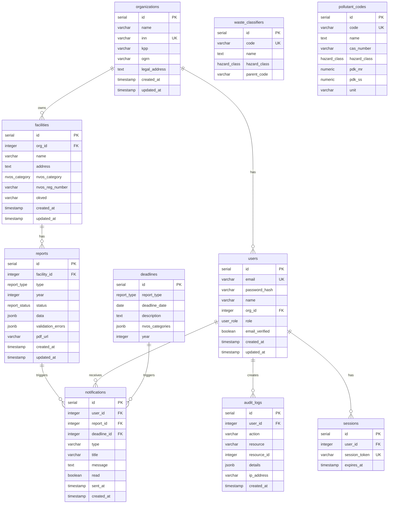

# Data Model — ER Diagram



## Table Purposes

| Table | Purpose | Row Estimate (MVP) |
|-------|---------|-------------------|
| organizations | Company profiles | ~100 |
| users | Auth accounts | ~200 |
| facilities | Production sites (NVOS objects) | ~300 |
| reports | 2-TP forms with JSONB data | ~1000 |
| waste_classifiers | FKKO reference (pre-seeded) | ~4500 |
| pollutant_codes | Pollutant reference (pre-seeded) | ~600 |
| deadlines | Annual deadlines (pre-seeded) | ~20/year |
| notifications | User notifications | ~5000 |
| audit_logs | Security audit trail | ~10000 |
| sessions | NextAuth sessions | ~200 |

## JSONB Structure: reports.data

Each report type has its own JSONB shape stored in `data` column.

### 2-TP Waste (2tp_waste)

```json
{
  "reportingPeriod": { "year": 2025 },
  "wasteRows": [
    {
      "fkkoCode": "1 71 101 01 52 1",
      "wasteName": "Ртутные лампы",
      "hazardClass": "I",
      "onStartYear": 0.5,
      "generated": 1.2,
      "receivedFromOthers": 0,
      "used": 0,
      "neutralized": 0,
      "transferred": 1.5,
      "placed": 0,
      "onEndYear": 0.2
    }
  ],
  "disposalFacilities": []
}
```

### 2-TP Air (2tp_air)

```json
{
  "reportingPeriod": { "year": 2025 },
  "emissionSources": [
    {
      "sourceId": "001",
      "sourceName": "Котельная",
      "pollutants": [
        {
          "pollutantCode": "0301",
          "pollutantName": "Азота диоксид",
          "permittedTonsPerYear": 5.0,
          "actualTonsPerYear": 3.2
        }
      ]
    }
  ],
  "reductionMeasures": []
}
```

### 2-TP Water (2tp_water)

```json
{
  "reportingPeriod": { "year": 2025 },
  "waterIntake": [
    {
      "sourceType": "surface",
      "sourceName": "р. Волга",
      "permitNumber": "12-34-56",
      "volumeByQuarter": [100, 120, 110, 90],
      "totalVolume": 420
    }
  ],
  "waterDischarge": [],
  "recyclingSystem": { "capacity": 50, "cyclesPerYear": 4 }
}
```
