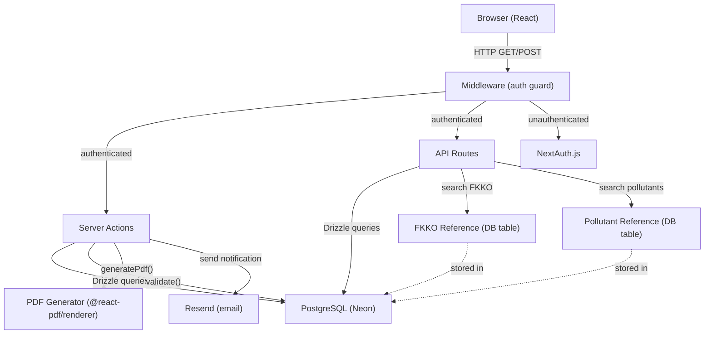
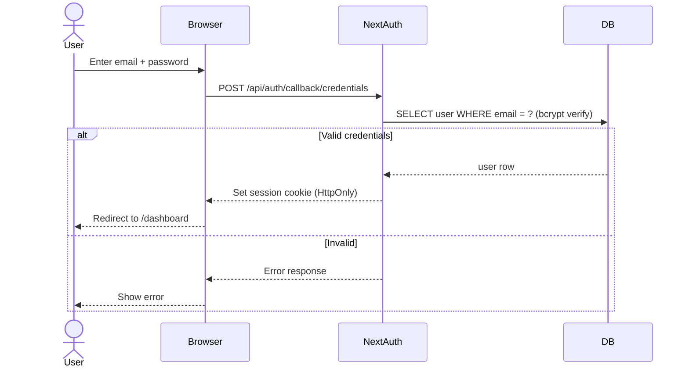
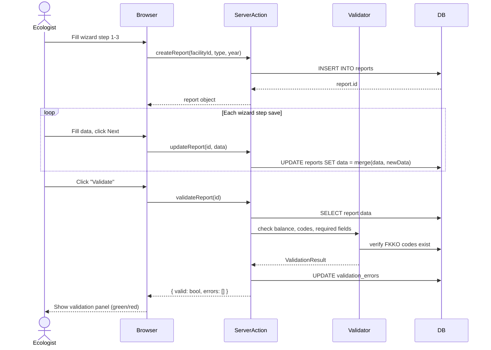
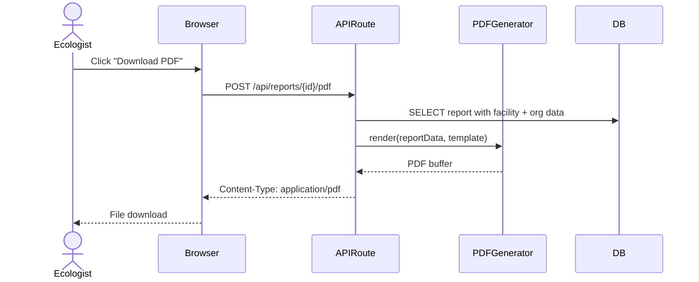
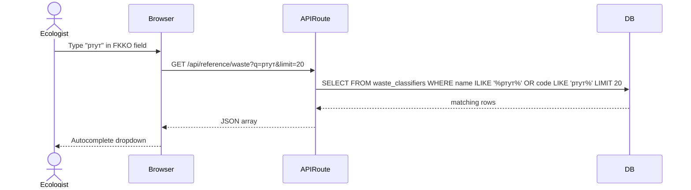
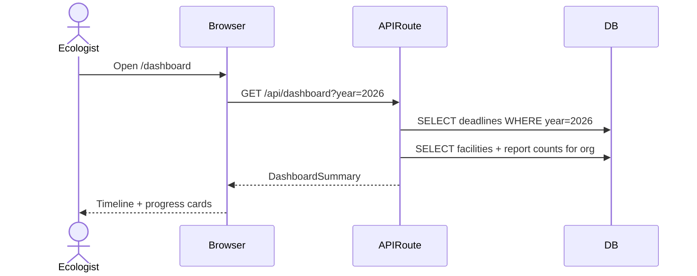

# Message Flows

## System Overview

Monolith Next.js application. All interactions are request/response over HTTP (browser to server) or function calls (Server Actions / API routes to database).

## Request Flows

### 1. Authentication

### 2. Report Creation + Validation

### 3. PDF Generation

### 4. Reference Data Search

### 5. Dashboard + Deadlines

## No Hidden Coupling

All data flows through explicit paths:
- Browser to Server: HTTP request/response (API routes or Server Actions)
- Server to Database: Drizzle ORM queries (parameterized, type-safe)
- Server to PDF: Function call to @react-pdf/renderer (synchronous, in-process)
- Server to Email: Resend API call (async, fire-and-forget with error logging)
- No shared mutable state between routes
- No message queues, no background workers in MVP
